# 23 — Pipeline Schematic and Current Position

**Status: 2026-09-18 PM.** The **CNS lock is OPEN and CONSUMED** — job
`323264626`, 642 samples scored exactly once, ledger
`results/LOCKED_EVALUATION_LEDGER.tsv`. Stage 7B has been **REACHED and
EXECUTED**. Results in
`results/cns_eval_2026-09-18/analysis_v3/cns_analysis_summary.md`; pre-unlock
record in `docs/29`; `docs/21` is the blocker ledger.

> **Changed since the 2026-09-16 version:** Stage 5 moved from RUNNING to
> COMPLETE, Stages 6 and 7 executed, the verdict fork resolved to "continue
> modelling", and a new Stage 5B (model repairs C1–C4) was inserted before the
> CNS lock can open.
>
> **Changed again 2026-09-17 PM:** C3 **downgraded** (the purity inversion was
> an artefact of C1, not purity capture), C1 **escalated** (the label-free fix
> failed), C2 clipping **adopted**, and two new branches added under C1 — C1b
> few-shot (viable) and C1c within-tissue rank (untested).
>
> **Changed again 2026-09-18 — the largest change this document has carried.**
> Five things moved:
>
> 1. **The unlock gate was corrected.** This document previously gated the CNS
>    unlock on *resolving* C1. `docs/27` §2 shows that is circular — the CNS
>    evaluation is the only experiment that can measure zero-shot calibration in
>    an untouched lineage, so C1 is a **finding to be tested**, not a
>    precondition. The gate is now **Gate B**: freeze discipline (pre-registered
>    candidate, checksummed artifact, predeclared metrics, auditable pre-unlock
>    record). The **deployment** gate, Gate A, remains shut and is untouched.
> 2. **New Stage 5C — V3-abs**, the single-factor within-tissue variance filter:
>    **7/7 sentinel gates, 7/7 selection criteria S1–S7**, frozen and shipped as
>    Candidate B. Removes **42.0%** of excess lineage structure at **no
>    significant ranking cost, and no significant ranking gain**.
> 3. **New Stage 5D — V4 lineage-penalised**: the one pre-registered
>    alternative, **FAILED G3**, the mechanism gate (tissue R² of predictions
>    rose 0.5219 → 0.5361). Branch terminated. Retained here because it is an
>    informative negative result.
> 4. **New Stage 7A — pre-unlock hardening** (`adf420b`): the shipping inference
>    path was audited and found unable to score anything at all. Five defects
>    fixed, ledger added.
> 5. **Stage 7B moved from NOT REACHED to EXECUTED**, and a new **Stage 9 — CNS
>    EVALUATION** records what came back: *rank transfers weakly, absolute
>    calibration does not*. The lock cannot be reopened.

---

## 1. Legend

| Colour | Meaning |
|---|---|
| Green | Complete and verified |
| Amber | Open work, next up |
| Red | Blocked, locked, or a serious unresolved defect |
| Blue | Gate or guard |

---

## 2. The whole pipeline

```mermaid
flowchart TD
    subgraph ACQ["STAGE 1 - ACQUISITION (COMPLETE)"]
        A1["TCGA PanCanAtlas download<br/>scripts/acquire_tcga.py<br/>41.5 GB, md5-gated"]
        A2["Resolve barcodes to cases<br/>scripts/resolve_tcga_cases.py"]
        A3["raw payload + sha256 sidecar<br/>data/raw/pancanatlas/"]
        A1 --> A2 --> A3
    end

    subgraph PREP["STAGE 2 - FEATURE PREP (COMPLETE)"]
        P1["Technical probe allowlist<br/>scripts/build_probe_bridge.py<br/>384,640 allowed probes"]
        P2["Bounded beta matrix<br/>scripts/prepare_beta.py<br/>writes provenance.json"]
        P3["beta.tsv<br/>336,480 probes x 7,707 samples<br/>28.2 GB on disk"]
        P1 --> P2 --> P3
    end

    subgraph LABEL["STAGE 3 - LABELS AND METADATA (COMPLETE)"]
        L1["Specimen-level join<br/>scripts/build_master.py<br/>ambiguous replicates EXCLUDED"]
        L2["CNV-derived features<br/>scripts/cnv_features.py"]
        L3["Cohort audit<br/>scripts/audit_cohort.py"]
        L4["master_samples.tsv<br/>patient_id, cancer_type,<br/>HRDsum, purity, ploidy"]
        L1 --> L4
        L2 --> L4
        L3 --> L4
    end

    A3 --> P1
    A3 --> L1

    subgraph SPLIT["STAGE 4 - THE LOCK (APPLIED, THEN OPENED)"]
        S1{"cancer_type is GBM or LGG?"}
        S2["LOCKED CNS PARTITION<br/>642 samples = 135 GBM + 507 LGG<br/>OPENED 2026-09-18, CONSUMED<br/>cannot be reused"]
        S3["DEVELOPMENT COHORT<br/>30 non-CNS cancer types<br/>n = 7,065"]
        S1 -->|yes| S2
        S1 -->|no| S3
    end

    P3 --> S1
    L4 --> S1

    subgraph MODEL["STAGE 5 - NESTED LOCO CV (COMPLETE)"]
        M1["LSF array 323078995<br/>30 tasks, 4 concurrent<br/>30 DONE / 0 EXIT"]
        M2["scripts/loco_one_fold.R"]
        M3["INNER LOOP in fit_en:<br/>each remaining cancer = one inner fold<br/>LOCO nested inside LOCO"]
        M4["6 quantities learned on TRAIN ROWS ONLY:<br/>medians, centres, scales,<br/>variance rank to 5,000 probes,<br/>lambda path, conformal width"]
        M5["Tuned alpha in 0.1 / 0.5 / 1<br/>lambda anchored to glmnet lambda.max<br/>0 of 30 folds hit a boundary"]
        M6["Refit on fold-train,<br/>score held-out cancer ONCE"]
        M7["Per-fold artefacts, 30 x 5 files<br/>results/loco_run01/folds/"]
        M1 --> M2 --> M3 --> M4 --> M5 --> M6 --> M7
    end

    S3 --> M1

    subgraph WATCH["AUTOMATION (RAN SUCCESSFULLY)"]
        W1["scripts/watch_loco_array.sh<br/>polled 300 s, detached"]
        W2["0 resubmissions needed"]
        W3["Fired merge at 06:20<br/>once all 30 were present"]
        W1 --> W2 --> W3
    end

    M7 --> W1

    subgraph MERGE["STAGE 6 - POOLED VERDICT (COMPLETE)"]
        G1["scripts/loco_merge.R<br/>refused partial cohorts; got 30/30"]
        G2["POOLED skill_vs_tissue_mean<br/>= +0.085<br/>MAE 9.049 vs null 9.890"]
        G3["Within-tissue Pearson = 0.612<br/>Spearman = 0.601"]
        G4["Within-tissue permutation<br/>p = 0.001, 1000 perms"]
        G5["Purity controls<br/>cor pred-purity = 0.165<br/>cor label-purity = 0.019"]
        G6["Lambda boundary: 0 of 30<br/>fit was NOT grid-limited"]
        G1 --> G2
        G1 --> G3
        G1 --> G4
        G1 --> G5
        G1 --> G6
    end

    W3 --> G1

    subgraph DECIDE["STAGE 7 - THE FORK (RESOLVED)"]
        D0["Apparent contradiction:<br/>skill only +0.085<br/>but within-tissue r = 0.61"]
        D1["RESOLVED: model ranks correctly<br/>WITHIN tissue but mis-levels<br/>each tissue by 3.46 units mean"]
        D2["Tissue explains 56.2% of predictions<br/>but only 34.1% of truth<br/>=> over-weights lineage"]
        D3["VERDICT: confound is REAL<br/>but NOT disqualifying.<br/>CONTINUE MODELLING,<br/>reframed as within-tissue ranker"]
        D0 --> D1 --> D2 --> D3
    end

    G2 --> D0
    G3 --> D0

    subgraph REPAIR["STAGE 5B - MODEL REPAIRS (investigated 2026-09-17)"]
        C1["C1 per-tissue calibration<br/>ESCALATED - label-free<br/>covariates FAILED, LOTO R2 -0.116"]
        C2["C2 zero floor - RESOLVED<br/>clip ADOPTED +0.008 skill<br/>log1p REJECTED, r fell 0.612 to 0.522"]
        C3["C3 purity inversion<br/>DOWNGRADED - artefact of C1<br/>partial cor rose 0.612 to 0.621"]
        C4["C4 OV is n=10<br/>disclosure, not a code fix"]
        C1B["C1b few-shot calibration<br/>VIABLE - k=10 gets 58% of gain<br/>k=3 actively HURTS"]
        C1R["C1c relative target V1/V2<br/>REFUTED - sentinel 323195423<br/>failed 3 of 7 gates"]
        C1 --> C1B
        C1 --> C1R
    end

    D3 --> C1
    D3 --> C2
    D3 --> C3
    D3 --> C4

    subgraph V3S["STAGE 5C - V3-abs (PASSED, SHIPPED)"]
        V3A["Single factor vs run 01:<br/>5,000-probe filter ranks by pooled<br/>WITHIN-TISSUE variance, train rows only.<br/>NOT docs/26 V3 - no target change"]
        V3B["Sentinel 4 folds, gates frozen<br/>docs/27 s5 before results existed<br/>7 of 7 PASSED"]
        V3C["Full 30-fold LOCO<br/>S1-S7 frozen in docs/28 s4<br/>7 of 7 PASSED - selects Candidate B"]
        V3D["tissue R2 of predictions<br/>0.5584 to 0.4672<br/>delta R2 excess 0.0913<br/>CI 0.0824-0.0996, p<0.0001<br/>42.0% of excess lineage removed"]
        V3E["HONEST LIMIT: ranking change<br/>NOT significant. Pearson -0.0161<br/>p=0.428, 12 of 30 improved.<br/>Targeted lineage cut at no<br/>ranking cost - NOT more accurate"]
        V3A --> V3B --> V3C --> V3D --> V3E
    end

    subgraph V4S["STAGE 5D - V4 lineage-penalized (FAILED, TERMINATED)"]
        V4A["The ONE pre-registered alternative,<br/>docs/27 s6: supervised within-tissue<br/>HRD meta-association minus lambda * lineage"]
        V4B["G3 MECHANISM GATE FAILED<br/>tissue R2 ROSE 0.5219 to 0.5361<br/>ceiling was 0.4919<br/>G1 G2 G4 G5 G6 G7 all passed"]
        V4C["lambda chosen by inner folds:<br/>0 for BRCA, 0.5 UCEC, 2 KICH/THCA.<br/>The penalty was not selected for.<br/>BRANCH TERMINATED per docs/27 s6"]
        V4A --> V4B --> V4C
    end

    C1R --> V3A
    C1R --> V4A
    C1B --> V3A

    subgraph HARD["STAGE 7A - PRE-UNLOCK HARDENING (commit adf420b)"]
        H1["predict_frozen.R never loaded glmnet:<br/>the shipping path COULD NOT SCORE<br/>ANYTHING AT ALL. Pre-existing."]
        H2["Adopted C2 clip never applied on<br/>the shipping path - emitted negative<br/>HRDsum. Fixed; raw value retained"]
        H3["No locked-partition guard, no record:<br/>--locked-evaluation opt-in plus<br/>append-only ledger"]
        H4["Two sources of truth for the lock:<br/>assert_partition_matches_cns()<br/>requires two-way agreement"]
        H5["loco_merge.R completeness gate<br/>now checks metrics/nullpanel counts<br/>and one target_transform AND<br/>feature_rank; ships tissue R2"]
        H1 --> H3
        H2 --> H3
        H3 --> H4 --> H5
    end

    subgraph FINAL["STAGE 7B - FREEZE AND UNLOCK (EXECUTED 2026-09-18)"]
        F1["FROZEN: Candidate B = V3-abs<br/>sha256 df9f7e82...<br/>Sensitivity A = run 01, 0e975cd6...<br/>both verified by sha256sum -c"]
        F2["CNS LOCK OPENED ONCE<br/>LSF job 323264626<br/>642 samples scored<br/>2 ledger rows, one per candidate"]
        F1 --> F2
    end

    V3E --> F1
    V4C -.->|"failed, does not ship"| F1
    C2 --> F1
    C3 --> F1
    C4 --> F1
    H5 --> F1
    S2 -->|"opened 2026-09-18, consumed"| F2

    subgraph CNSEV["STAGE 9 - CNS EVALUATION (COMPLETE, NOT REPEATABLE)"]
        N1["PRIMARY B: GBM r=0.320 rho=0.279<br/>MAE 8.86 bias +7.99 slope 0.358<br/>LGG r=0.329 rho=0.297<br/>MAE 5.13 bias +1.62 slope 0.578"]
        N2["SENSITIVITY A: GBM r=0.293,<br/>LGG r=0.371. CIs overlap heavily,<br/>neither candidate clearly better"]
        N3["ORACLE tissue-mean null BEATS<br/>the model: skill -1.009 GBM,<br/>-0.048 LGG, -0.233 pooled"]
        N4["PLACEMENT: GBM Pearson 13.3rd pct<br/>LGG 16.7th, GBM bias 10th pct.<br/>CNS is a POOR RELATION, not a<br/>typical held-out tissue"]
        N5["VERDICT - outcome A of 3 pre-declared:<br/>RANK TRANSFERS WEAKLY,<br/>ABSOLUTE CALIBRATION DOES NOT"]
        N6["42% source-side lineage reduction<br/>did NOT translate into better CNS<br/>calibration. Cutting lineage inside<br/>the training distribution was NOT<br/>sufficient for transfer outside it"]
        N1 --> N5
        N2 --> N5
        N3 --> N5
        N4 --> N5
        N5 --> N6
    end

    F2 --> N1
    F2 --> N2

    subgraph NEWB["BLOCKERS OPENED BY THE UNLOCK"]
        B17["B17 OOD rule did NOT flag CNS<br/>8 of 642, all LGG. The frozen<br/>reportability rule gave no warning<br/>on a lineage where the model<br/>loses to the mean. A DEFECT"]
        B18["B18 HRDsum>=42 VACUOUS in CNS<br/>0 GBM and exactly 1 LGG above it.<br/>No binary claim is possible"]
        B20["B20 bsub exited non-zero AFTER<br/>scoring succeeded and the ledger<br/>was written. Script-contract<br/>mismatch. No rescoring"]
    end

    N5 --> B17
    N5 --> B18
    F2 --> B20

    GATEA["DEPLOYMENT GATE A<br/>STAYS SHUT<br/>no validated clinical HRD assay"]
    N6 --> GATEA

    subgraph INFER["STAGE 8 - INFERENCE (gated, B7 CLOSED, B19 hardened)"]
        I1["scripts/predict_frozen.R"]
        I2["PROVENANCE GATE - R/provenance.R<br/>runs BEFORE matrix is read"]
        I3{"sidecar verdict"}
        I4["REFUSED: fixture / no sidecar /<br/>no allowlist hash"]
        I5["Scored + stamped with<br/>matrix_provenance_class"]
        I6["app/app.R - B10 governance<br/>still OPEN"]
        I1 --> I2 --> I3
        I3 -->|fail| I4
        I3 -->|pass| I5 --> I6
    end

    H5 --> I1
    GATEA --> I6

    style ACQ fill:#d4edda
    style PREP fill:#d4edda
    style LABEL fill:#d4edda
    style MODEL fill:#d4edda
    style WATCH fill:#d4edda
    style MERGE fill:#d4edda
    style DECIDE fill:#d4edda
    style REPAIR fill:#fff3cd
    style V3S fill:#d4edda
    style V4S fill:#f8d7da
    style HARD fill:#d4edda
    style FINAL fill:#d4edda
    style CNSEV fill:#ffe08a
    style NEWB fill:#fff3cd
    style S2 fill:#d1e7dd,stroke:#0f5132,stroke-width:3px
    style D3 fill:#d1e7dd,stroke:#0f5132,stroke-width:4px
    style G2 fill:#d1e7dd,stroke:#0f5132,stroke-width:2px
    style G3 fill:#d1e7dd,stroke:#0f5132,stroke-width:2px
    style C1 fill:#f8d7da,stroke:#b02a37,stroke-width:3px
    style C2 fill:#d1e7dd,stroke:#0f5132,stroke-width:2px
    style C3 fill:#ffe08a
    style C4 fill:#ffe08a
    style C1B fill:#d1e7dd,stroke:#0f5132,stroke-width:2px
    style C1R fill:#f8d7da,stroke:#b02a37,stroke-width:2px
    style V3D fill:#d1e7dd,stroke:#0f5132,stroke-width:3px
    style V3E fill:#fff3cd,stroke:#d39e00,stroke-width:2px
    style V4B fill:#f8d7da,stroke:#b02a37,stroke-width:3px
    style H1 fill:#f8d7da,stroke:#b02a37,stroke-width:2px
    style F1 fill:#cfe2ff,stroke:#084298,stroke-width:2px
    style F2 fill:#d1e7dd,stroke:#0f5132,stroke-width:4px
    style N3 fill:#f8d7da,stroke:#b02a37,stroke-width:2px
    style N4 fill:#f8d7da,stroke:#b02a37,stroke-width:2px
    style N5 fill:#ffe08a,stroke:#d39e00,stroke-width:4px
    style N6 fill:#ffe08a,stroke:#d39e00,stroke-width:3px
    style B17 fill:#f8d7da,stroke:#b02a37,stroke-width:3px
    style B18 fill:#fff3cd,stroke:#d39e00
    style B20 fill:#fff3cd
    style GATEA fill:#f8d7da,stroke:#b02a37,stroke-width:4px
    style I2 fill:#cfe2ff,stroke:#084298,stroke-width:2px
    style I6 fill:#fff3cd
```

---

## 3. Stage status table

| Stage | State | Evidence |
|---|---|---|
| 1 Acquisition | **COMPLETE** | checksum-verified, 41.5 GB |
| 2 Feature prep | **COMPLETE** | `engineering_only: false` |
| 3 Labels | **COMPLETE** | `master_samples.tsv` |
| 4 Lock | **APPLIED, THEN OPENED AND CONSUMED** | `results/LOCKED_EVALUATION_LEDGER.tsv`, 2 rows, 2026-09-18 |
| 5 Nested LOCO CV | **COMPLETE** | 30/30 DONE, 0 EXIT, 6.7 h |
| 6 Merge | **COMPLETE** | 11 result files, 06:20 |
| 7 Fork | **RESOLVED — continue** | `docs/24` §6 |
| **5B Repairs** | **Investigated; C1 unsolved by these routes** | `docs/25` |
| **5C V3-abs** | **PASSED 7/7 gates, 7/7 S1–S7 — SHIPPED** | `results/v3_sentinel/gate_scorecard.tsv`, `results/v3_loco_full/selection_scorecard.tsv` |
| **5D V4 lineage-penalised** | **FAILED G3 — TERMINATED** | `results/v4_sentinel/gate_scorecard.tsv` |
| **7A Pre-unlock hardening** | **DONE** | commit `adf420b`, 7 suites pass |
| 7B Freeze + unlock | **REACHED AND EXECUTED 2026-09-18** | job `323264626`; `docs/29` pre-unlock record |
| 8 Inference | **EXERCISED** — and it did not work before `adf420b` | `docs/21` B19 |
| **9 CNS evaluation** | **COMPLETE, NOT REPEATABLE** | `results/cns_eval_2026-09-18/analysis_v3/cns_analysis_summary.md` |

The planned "re-run the array and confirm skill improves" step (shown as C5 in
the 2026-09-17 version of this diagram) was **superseded rather than skipped**:
the full 30-fold V3-abs run *is* that re-run, and it was scored against a
selection rule written before it returned rather than against an informal
"did it improve" judgement.

### Stage 5B detail

| Defect | Status | Evidence |
|---|---|---|
| C1 calibration | **TESTED ON CNS — CONFIRMED dominant** | characterised, ~42% mitigated in-distribution, still decisive out of it |
| C1b few-shot | **VIABLE** | k=10 → 58% of achievable gain; k=3 hurts unshrunk |
| C1c rank-only, V1/V2 | **REFUTED** | sentinel `323195423`, 3 of 7 gates failed |
| C1c V3-abs | **PASSED — shipped as Candidate B** | 7/7 and 7/7; see Stage 5C |
| C2 clip | **ADOPTED** | MAE 9.049 → 8.972, Spearman 1.000 — but not applied on the shipping path until `adf420b` (B19) |
| C2 log1p | **REJECTED** | 30/30 folds: MAE better but within-tissue r 0.612 → 0.522 |
| C3 purity | **DOWNGRADED** | partial cor rose 0.612 → 0.621; CNS purity populated 632/642 |
| C4 OV n=10 | **OPEN** | disclosure only; now joined by B18 |

### Stage 5C detail — V3-abs, full 30-fold

One factor changed from run 01: the 5,000-probe filter ranks by pooled
**within-tissue** variance on training-fold rows only. This is **not** the V3 of
`docs/26` §4, which additionally carried V2's refuted relative target.
From `results/tables/tableA2_A_vs_V3_full30.md`:

| Statistic | A (run 01) | V3-abs |
|---|---:|---:|
| Macro within-tissue Pearson | 0.5197 | 0.5036 |
| Macro within-tissue Spearman | 0.4747 | 0.4472 |
| Pooled MAE | 8.9717 | 8.4456 |
| Mean absolute tissue bias | 3.4628 | 2.9737 |
| **Tissue R² of predictions** | **0.5584** | **0.4672** |
| Tissue R² of truth | 0.3414 | 0.3414 (unchanged) |
| Macro skill vs oracle tissue-mean null | 0.4192 | 0.6304 |
| Tissues with positive within-tissue r | 29 of 30 | 29 of 30 |

`ΔR²_excess = 0.0913`, 95% CI [0.0824, 0.0996], p < 0.0001 — **42.0%
(CI 37.9–46.5%) of the excess lineage structure removed**.

**The ranking change is not significant**: paired Pearson mean −0.0161, 95% CI
[−0.0410, 0.0051], Wilcoxon p = 0.428, 12 of 30 improved; Spearman mean
−0.0275, p = 0.477, 14 of 30 improved. Read this as **a targeted reduction in
lineage imprinting at no measurable ranking cost**, not as a better model.

### Stage 9 detail — the locked CNS result

Primary Candidate B, from
`results/cns_eval_2026-09-18/analysis_v3/cns_analysis_summary.md`:

| Group | n | Pearson [95% CI] | Spearman | MAE | bias | slope | oracle-null skill |
|---|---:|---|---:|---:|---:|---:|---:|
| GBM | 135 | 0.320 [0.173, 0.461] | 0.279 | 8.86 | +7.99 | 0.358 | −1.009 |
| LGG | 507 | 0.329 [0.234, 0.421] | 0.297 | 5.13 | +1.62 | 0.578 | −0.048 |
| CNS pooled | 642 | 0.261 [0.183, 0.335] | 0.242 | 5.92 | +2.96 | 0.358 | −0.233 |

Sensitivity Candidate A: GBM r = 0.293 [0.142, 0.446], ρ = 0.310, MAE 9.79,
bias +9.11, slope 0.327; LGG r = 0.371 [0.278, 0.460], ρ = 0.311, MAE 5.95,
bias +3.69, slope 0.692. **CIs overlap heavily; neither candidate is clearly
better on CNS.** Both are reported because `docs/28` §5 clause 3 forbids
reporting only the better one.

Placement among the 30 source LOCO tissues (32 = 30 + GBM + LGG): GBM Pearson
13.3rd percentile (28th), LGG Pearson 16.7th (26th), GBM |bias| 10th (29th).
LGG MAE is 83.3rd (6th) — the one favourable placement, and it reflects LGG's
low, tight HRDsum distribution rather than calibration.

**Verdict: outcome A of the three pre-declared in `docs/28` §7** — rank
transfers weakly, absolute cross-lineage calibration does not. The deployment
gate stays shut.

Measured cost: 55 min/fold, **173 GB peak** (vs 240 GB reserved), memory-bound
not CPU-bound, 6.7 h wall for the full array.

---

## 4. What now needs to be done, in order

**Revised 2026-09-17 PM after the C1/C2/C3 investigation (`docs/25`).** The
priority order below is not the one this document carried this morning — two
defects swapped places once measured.

1. **C2 — RESOLVED.** Clipping adopted (free, +0.008 skill, ranking exactly
   preserved). log1p **rejected** on the full 30-fold run: it improves absolute
   MAE (9.049 → 8.827) but degrades within-tissue correlation
   (0.612 → 0.522) in 20 of 30 tissues, including the high-HRD tissues where
   discrimination matters most.
2. **C1 — now the hard problem, not a quick fix.** The label-free tissue
   covariate approach failed leave-one-tissue-out in every configuration
   (best R² = −0.116, worse than a constant). Two supported paths remain:
   - **C1b few-shot**: ~10 labelled samples from the new tissue recover 58% of
     the achievable gain. k=3 actively hurts. Works, but it is an ask.
   - **C1c within-tissue rank only**: honest and matches the clinical question,
     but needs a same-type reference cohort at prediction time. Untested.
   - Neither solves the **N-of-1 pediatric case**. This is an open scientific
     problem.
3. **C3 purity** — downgraded. The inversion was C1's fixed offset eating a
   shrinking margin, not purity capture. A residual gradient survives
   correction, so it is not closed. The untested piece is whether individual
   selected CpGs are purity-associated (~4 h probe-level job).
4. **C4 OV disclosure** — one paragraph in every presentation.
5. **Re-run the array** with the adopted transform and confirm skill improves.
6. **Freeze, then open the CNS lock once.**
7. **B10 app governance** before anything is demoed publicly.

**Revised again 2026-09-18 — items 5 and 6 above are DONE and item 6 cannot be
repeated.** The order that remains:

1. **B17 — the OOD reportability rule did not flag CNS** (8 of 642, all LGG).
   This is now the highest-value open item, because the pediatric transfer is a
   *larger* domain shift than the one the flag just failed to see. Characterise
   the score against **source** data only; do not re-tune it against the CNS
   labels we have now consumed.
2. **B18 + C4 — cohort composition.** 0 GBM and 1 LGG sample reach HRDsum ≥ 42,
   and OV is n = 10. The project developed and externally tested largely in the
   **low-HRD regime**; every presented artefact should say so once, plainly.
3. **B20 — job-status hygiene.** A one-shot job must fail with an exit status
   that identifies *which stage* failed.
4. **B10 app governance**, carrying the B17 caveat, before any public demo.
5. **B15 — `renv.lock`** snapshot on the analysis host.
6. **B11 / B12 — pediatric readiness**, now carrying the CNS result as its
   prior: absolute HRDsum on an unseen lineage is not supported.
7. **Document, do not implement, the next-generation hypothesis** — that
   cutting lineage imprinting inside the source distribution is *necessary but
   not sufficient* for cross-lineage calibration (`docs/28` §7, `docs/29` §4).
   Whether it is even necessary is untested, and untestable on this cohort.

---

## 5. Non-obvious constraints

- **`rusage[mem]` is PER SLOT.** LSF multiplies by `-n`. `60GB x 4 = 240GB`.
  Writing `230GB` with `-n 8` requests 1,840 GB and silently pends forever.
  Cost: one dead array (323078478).
- **The biohackathon queue is two nodes**: `noderome117` (1,003 GB),
  `nodegpu217` (1,435 GB).
- **336,480 is not 384,640.** The allowlist is 384,640; 336,480 is its
  intersection with probes actually present.
- **Login node `nodelmr12` has ~3 GB free.** Never load the matrix there. The
  merge is safe because it reads per-fold summaries, not the matrix.
- **Leakage rule.** No feature screening on the full cohort, ever. This
  constrains the C1 fix specifically — and V3-abs obeys it: the within-tissue
  variance statistic is recomputed inside every training fold, outer and inner,
  on that fold's rows only (`R/model.R:275`, tested in
  `tests/test_v3_feature_rank.R`).
- **The CNS lock opens exactly once. It has now been opened.** Every additional
  look would erode it, and there is nothing left to erode: the 642 labels are
  read, the ledger has two rows, and no further CNS evaluation is admissible.
  A threshold, calibration or model tuned on these samples would be tuned on
  the test set.
- **A non-zero exit does not mean nothing happened.** The CNS job exited
  non-zero *after* scoring succeeded and the ledger was written (B20). The
  ledger is what distinguishes the two cases; without it, the only honest
  option would have been to treat the lock as consumed anyway.
- **Mermaid diagrams in this repository are validated by rendering through
  Quarto** before commit. Validate with `mermaid-format: png`, not the default
  HTML output: the HTML path embeds the diagram source for client-side
  rendering and therefore **succeeds even on syntactically invalid mermaid**,
  while the PNG path renders server-side and fails loudly. Confirmed on
  2026-09-18/22 against a deliberately malformed control.
