# 23 — Pipeline Schematic and Current Position

**Status: 2026-09-17 PM.** Array `323078995` **COMPLETE** (30/30 folds, merged
06:20). First real result exists — see `docs/24_RESULTS_LOCO_RUN01.md`.
Defects C1–C4 investigated — see `docs/25_C1_C2_C3_INVESTIGATION.md`.
`docs/21` is the blocker ledger.

> **Changed since the 2026-09-16 version:** Stage 5 moved from RUNNING to
> COMPLETE, Stages 6 and 7 executed, the verdict fork resolved to "continue
> modelling", and a new Stage 5B (model repairs C1–C4) was inserted before the
> CNS lock can open.
>
> **Changed again 2026-09-17 PM:** C3 **downgraded** (the purity inversion was
> an artefact of C1, not purity capture), C1 **escalated** (the label-free fix
> failed), C2 clipping **adopted**, and two new branches added under C1 — C1b
> few-shot (viable) and C1c within-tissue rank (untested).

---

## 1. Legend

| Colour | Meaning |
|---|---|
| Green | Complete and verified |
| Amber | Open work, next up |
| Red | Blocked, locked, or a serious unresolved defect |
| Blue | Gate or guard |

---

## 2. The whole pipeline

```mermaid
flowchart TD
    subgraph ACQ["STAGE 1 - ACQUISITION (COMPLETE)"]
        A1["TCGA PanCanAtlas download<br/>scripts/acquire_tcga.py<br/>41.5 GB, md5-gated"]
        A2["Resolve barcodes to cases<br/>scripts/resolve_tcga_cases.py"]
        A3["raw payload + sha256 sidecar<br/>data/raw/pancanatlas/"]
        A1 --> A2 --> A3
    end

    subgraph PREP["STAGE 2 - FEATURE PREP (COMPLETE)"]
        P1["Technical probe allowlist<br/>scripts/build_probe_bridge.py<br/>384,640 allowed probes"]
        P2["Bounded beta matrix<br/>scripts/prepare_beta.py<br/>writes provenance.json"]
        P3["beta.tsv<br/>336,480 probes x 7,707 samples<br/>28.2 GB on disk"]
        P1 --> P2 --> P3
    end

    subgraph LABEL["STAGE 3 - LABELS AND METADATA (COMPLETE)"]
        L1["Specimen-level join<br/>scripts/build_master.py<br/>ambiguous replicates EXCLUDED"]
        L2["CNV-derived features<br/>scripts/cnv_features.py"]
        L3["Cohort audit<br/>scripts/audit_cohort.py"]
        L4["master_samples.tsv<br/>patient_id, cancer_type,<br/>HRDsum, purity, ploidy"]
        L1 --> L4
        L2 --> L4
        L3 --> L4
    end

    A3 --> P1
    A3 --> L1

    subgraph SPLIT["STAGE 4 - THE LOCK (APPLIED)"]
        S1{"cancer_type is GBM or LGG?"}
        S2["LOCKED CNS PARTITION<br/>642 samples<br/>STILL UNOPENED as of 2026-09-17"]
        S3["DEVELOPMENT COHORT<br/>30 non-CNS cancer types<br/>n = 7,065"]
        S1 -->|yes| S2
        S1 -->|no| S3
    end

    P3 --> S1
    L4 --> S1

    subgraph MODEL["STAGE 5 - NESTED LOCO CV (COMPLETE)"]
        M1["LSF array 323078995<br/>30 tasks, 4 concurrent<br/>30 DONE / 0 EXIT"]
        M2["scripts/loco_one_fold.R"]
        M3["INNER LOOP in fit_en:<br/>each remaining cancer = one inner fold<br/>LOCO nested inside LOCO"]
        M4["6 quantities learned on TRAIN ROWS ONLY:<br/>medians, centres, scales,<br/>variance rank to 5,000 probes,<br/>lambda path, conformal width"]
        M5["Tuned alpha in 0.1 / 0.5 / 1<br/>lambda anchored to glmnet lambda.max<br/>0 of 30 folds hit a boundary"]
        M6["Refit on fold-train,<br/>score held-out cancer ONCE"]
        M7["Per-fold artefacts, 30 x 5 files<br/>results/loco_run01/folds/"]
        M1 --> M2 --> M3 --> M4 --> M5 --> M6 --> M7
    end

    S3 --> M1

    subgraph WATCH["AUTOMATION (RAN SUCCESSFULLY)"]
        W1["scripts/watch_loco_array.sh<br/>polled 300 s, detached"]
        W2["0 resubmissions needed"]
        W3["Fired merge at 06:20<br/>once all 30 were present"]
        W1 --> W2 --> W3
    end

    M7 --> W1

    subgraph MERGE["STAGE 6 - POOLED VERDICT (COMPLETE)"]
        G1["scripts/loco_merge.R<br/>refused partial cohorts; got 30/30"]
        G2["POOLED skill_vs_tissue_mean<br/>= +0.085<br/>MAE 9.049 vs null 9.890"]
        G3["Within-tissue Pearson = 0.612<br/>Spearman = 0.601"]
        G4["Within-tissue permutation<br/>p = 0.001, 1000 perms"]
        G5["Purity controls<br/>cor pred-purity = 0.165<br/>cor label-purity = 0.019"]
        G6["Lambda boundary: 0 of 30<br/>fit was NOT grid-limited"]
        G1 --> G2
        G1 --> G3
        G1 --> G4
        G1 --> G5
        G1 --> G6
    end

    W3 --> G1

    subgraph DECIDE["STAGE 7 - THE FORK (RESOLVED)"]
        D0["Apparent contradiction:<br/>skill only +0.085<br/>but within-tissue r = 0.61"]
        D1["RESOLVED: model ranks correctly<br/>WITHIN tissue but mis-levels<br/>each tissue by 3.46 units mean"]
        D2["Tissue explains 56.2% of predictions<br/>but only 34.1% of truth<br/>=> over-weights lineage"]
        D3["VERDICT: confound is REAL<br/>but NOT disqualifying.<br/>CONTINUE MODELLING,<br/>reframed as within-tissue ranker"]
        D0 --> D1 --> D2 --> D3
    end

    G2 --> D0
    G3 --> D0

    subgraph REPAIR["STAGE 5B - MODEL REPAIRS (investigated 2026-09-17)"]
        C1["C1 per-tissue calibration<br/>ESCALATED - label-free<br/>covariates FAILED, LOTO R2 -0.116"]
        C2["C2 zero floor - RESOLVED<br/>clip ADOPTED +0.008 skill<br/>log1p REJECTED, r fell 0.612 to 0.522"]
        C3["C3 purity inversion<br/>DOWNGRADED - artefact of C1<br/>partial cor rose 0.612 to 0.621"]
        C4["C4 OV is n=10<br/>disclosure, not a code fix"]
        C1B["C1b few-shot calibration<br/>VIABLE - k=10 gets 58% of gain<br/>k=3 actively HURTS"]
        C1R["C1c within-tissue rank only<br/>UNTESTED - needs same-type<br/>cohort at prediction time"]
        C5["Re-run array, confirm<br/>skill improves"]
        C1 --> C1B
        C1 --> C1R
        C1B --> C5
        C1R --> C5
        C2 --> C5
        C3 --> C5
        C4 --> C5
    end

    D3 --> C1
    D3 --> C2
    D3 --> C3
    D3 --> C4

    subgraph FINAL["STAGE 7B - FREEZE AND UNLOCK (NOT REACHED)"]
        F1["Freeze model"]
        F2["Open CNS lock ONCE<br/>score GBM + LGG<br/>642 held-out samples"]
        F1 --> F2
    end

    C5 --> F1
    S2 -.->|"opens only after C1-C4"| F2

    subgraph INFER["STAGE 8 - INFERENCE (gated, B7 CLOSED)"]
        I1["scripts/predict_frozen.R"]
        I2["PROVENANCE GATE - R/provenance.R<br/>runs BEFORE matrix is read"]
        I3{"sidecar verdict"}
        I4["REFUSED: fixture / no sidecar /<br/>no allowlist hash"]
        I5["Scored + stamped with<br/>matrix_provenance_class"]
        I6["app/app.R - B10 governance<br/>still OPEN"]
        I1 --> I2 --> I3
        I3 -->|fail| I4
        I3 -->|pass| I5 --> I6
    end

    F2 --> I1

    style ACQ fill:#d4edda
    style PREP fill:#d4edda
    style LABEL fill:#d4edda
    style MODEL fill:#d4edda
    style WATCH fill:#d4edda
    style MERGE fill:#d4edda
    style DECIDE fill:#d4edda
    style REPAIR fill:#fff3cd
    style S2 fill:#f8d7da,stroke:#b02a37,stroke-width:3px
    style D3 fill:#d1e7dd,stroke:#0f5132,stroke-width:4px
    style G2 fill:#d1e7dd,stroke:#0f5132,stroke-width:2px
    style G3 fill:#d1e7dd,stroke:#0f5132,stroke-width:2px
    style C1 fill:#f8d7da,stroke:#b02a37,stroke-width:3px
    style C2 fill:#d1e7dd,stroke:#0f5132,stroke-width:2px
    style C3 fill:#ffe08a
    style C4 fill:#ffe08a
    style C1B fill:#d1e7dd,stroke:#0f5132,stroke-width:2px
    style C1R fill:#ffe08a
    style F2 fill:#f8d7da,stroke:#b02a37,stroke-width:2px
    style I2 fill:#cfe2ff,stroke:#084298,stroke-width:2px
    style I6 fill:#fff3cd
```

---

## 3. Stage status table

| Stage | State | Evidence |
|---|---|---|
| 1 Acquisition | **COMPLETE** | checksum-verified, 41.5 GB |
| 2 Feature prep | **COMPLETE** | `engineering_only: false` |
| 3 Labels | **COMPLETE** | `master_samples.tsv` |
| 4 Lock | **APPLIED** | GBM+LGG untouched |
| 5 Nested LOCO CV | **COMPLETE** | 30/30 DONE, 0 EXIT, 6.7 h |
| 6 Merge | **COMPLETE** | 11 result files, 06:20 |
| 7 Fork | **RESOLVED — continue** | `docs/24` §6 |
| **5B Repairs** | **Investigated; C1 unsolved** | `docs/25` |
| 7B Freeze + unlock | Not reached | gated on C1–C4 |
| 8 Inference | Code ready, gate closed | nothing scored yet |

### Stage 5B detail

| Defect | Status | Evidence |
|---|---|---|
| C1 calibration | **ESCALATED — label-free fix failed** | LOTO R² −0.116, worse than a constant |
| C1b few-shot | **VIABLE** | k=10 → 58% of achievable gain; k=3 hurts |
| C1c rank-only | **UNTESTED** | needs same-type cohort at predict time |
| C2 clip | **ADOPTED** | MAE 9.049 → 8.972, Spearman 1.000 |
| C2 log1p | **REJECTED** | 30/30 folds: MAE better but within-tissue r 0.612 → 0.522 |
| C3 purity | **DOWNGRADED** | partial cor rose 0.612 → 0.621 |
| C4 OV n=10 | **OPEN** | disclosure only |

Measured cost: 55 min/fold, **173 GB peak** (vs 240 GB reserved), memory-bound
not CPU-bound, 6.7 h wall for the full array.

---

## 4. What now needs to be done, in order

**Revised 2026-09-17 PM after the C1/C2/C3 investigation (`docs/25`).** The
priority order below is not the one this document carried this morning — two
defects swapped places once measured.

1. **C2 — RESOLVED.** Clipping adopted (free, +0.008 skill, ranking exactly
   preserved). log1p **rejected** on the full 30-fold run: it improves absolute
   MAE (9.049 → 8.827) but degrades within-tissue correlation
   (0.612 → 0.522) in 20 of 30 tissues, including the high-HRD tissues where
   discrimination matters most.
2. **C1 — now the hard problem, not a quick fix.** The label-free tissue
   covariate approach failed leave-one-tissue-out in every configuration
   (best R² = −0.116, worse than a constant). Two supported paths remain:
   - **C1b few-shot**: ~10 labelled samples from the new tissue recover 58% of
     the achievable gain. k=3 actively hurts. Works, but it is an ask.
   - **C1c within-tissue rank only**: honest and matches the clinical question,
     but needs a same-type reference cohort at prediction time. Untested.
   - Neither solves the **N-of-1 pediatric case**. This is an open scientific
     problem.
3. **C3 purity** — downgraded. The inversion was C1's fixed offset eating a
   shrinking margin, not purity capture. A residual gradient survives
   correction, so it is not closed. The untested piece is whether individual
   selected CpGs are purity-associated (~4 h probe-level job).
4. **C4 OV disclosure** — one paragraph in every presentation.
5. **Re-run the array** with the adopted transform and confirm skill improves.
6. **Freeze, then open the CNS lock once.**
7. **B10 app governance** before anything is demoed publicly.

---

## 5. Non-obvious constraints

- **`rusage[mem]` is PER SLOT.** LSF multiplies by `-n`. `60GB x 4 = 240GB`.
  Writing `230GB` with `-n 8` requests 1,840 GB and silently pends forever.
  Cost: one dead array (323078478).
- **The biohackathon queue is two nodes**: `noderome117` (1,003 GB),
  `nodegpu217` (1,435 GB).
- **336,480 is not 384,640.** The allowlist is 384,640; 336,480 is its
  intersection with probes actually present.
- **Login node `nodelmr12` has ~3 GB free.** Never load the matrix there. The
  merge is safe because it reads per-fold summaries, not the matrix.
- **Leakage rule.** No feature screening on the full cohort, ever. This
  constrains the C1 fix specifically.
- **The CNS lock opens exactly once.** Every additional look erodes it.
